# Introduction to Custom Components

While building your Raisely campaigns, sometimes you'll encounter situations where you need to customise your pages to meet unique requirements. Using Raisely's custom components, this has never been easier.

> The following guide assumes that you have an administration account with Raisely. If you don't have one for your campaign, [you can sign up for free here](https://beta.raisely.com/start).

## Building your first component

To create your first custom component click on the **Organisation** area within the left sidebar. Once there, you can navigate to the components view by clicking on the **Custom Components** card on the left.

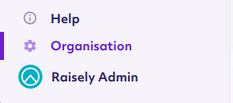

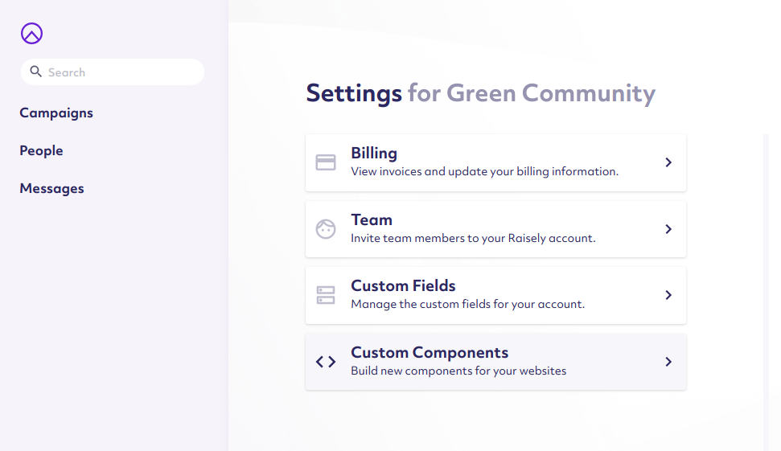

Click the **Add new component** button to get started with creating your first component.

You will be first prompted to enter in a unique name for your Component. This **Component Name** will be used to identify your custom component across your entire Raisely Organisation, so be sure to name it accurately. For our demonstration, we will be using **"our-first-component"** to describe our first testable component.

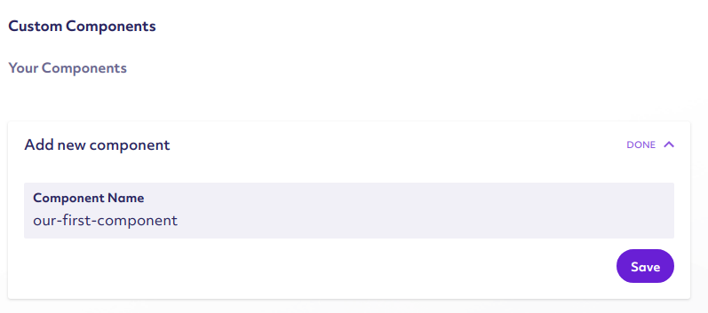

Once you are satisfied with the name you chose, press the **Save** button to create the Raisely component. Once created, the component will be available for editing within the right hand side of the page. **Click on the component's name** to bring up the editing area.

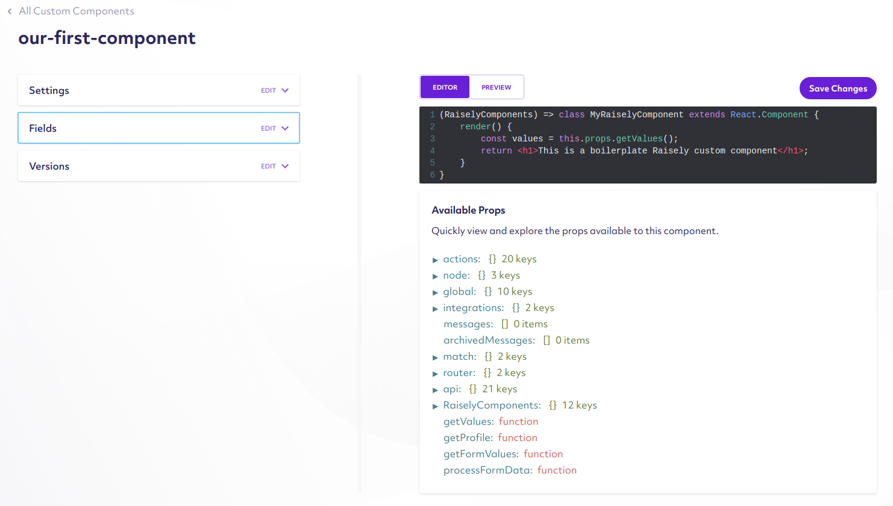

Take note of the setting options on the left-hand side, and the colorized editing area on the right. For now we will solely focus on creating a simple component via the colorized textbox on the right hand side.

Replace the content of the textbox with the following:

```js
() => (props) => {
    return (
        <h1>Hello world! This is my first component</h1>
    );
}
```

For those familiar, we're  use a template format for Raisely called JSX, which allows you to embed and create layouts and components using HTML-like markup. In the small snippet above, we created the structure for a component that simply renders a Level 1 Heading with the words `"Hello world! This is my first component"`.

> You can learn more about JSX syntax [from the official React documentation](https://reactjs.org/docs/getting-started.html#learn-react)

### Previewing and Testing your component

Now that you have entered new code into the editor, it's time to test your component to ensure it's working as expected. To do this, hit the **Save Changes** button, and then click the **Preview** tab positioned directly above the colorized text editor.

You'll then be greeted with a card showing you the generated output of your new component:

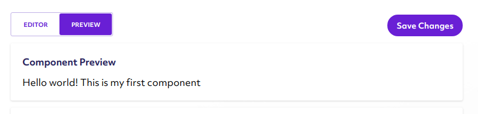


The above example is a simple example of how to do templates, but this isn't a very reusable way to add content to your site. To do this, we enable you to specify custom component fields that allow you to explicitly specify values while editing your components.

## Adding custom fields

On the left hand side of the Custom component editing view, there is a card labelled **Fields**. This area is responsible to allowing you to provide the names of properties that you can configure after adding them to your pages.

> Read the Accessing Advanced values within Components article for an overview of all the available values :thumbs_up:

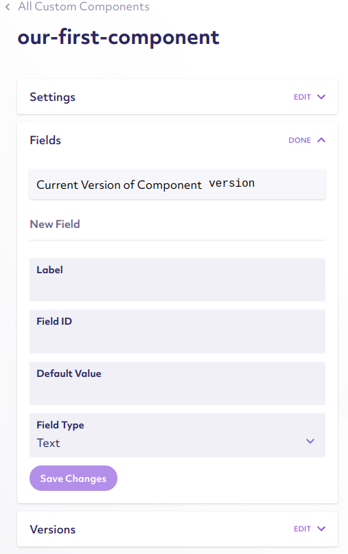

To add a new custom field, open the **Fields** card on the left. Under the **New Fields** heading, you can specify a **Label**, **Label ID**, **Default Value**, and a **Field Type**. A label represents the text shown while configuring your Component during page editing, while the Label ID represents how the value is stored and accessed within your custom component. These are the two required values you must specify when creating a new field.

For our example, we will set a **Label** of **"Our First Field"** and a **Field ID** of **"ourField"**. We will also specify a **Default Value** of **"My First Field!"** to demonstrate the field values.

> **Field ID** is used for identifying and storing field data. As a result, it's typically a best practice to use `camelCase` style names to make it easier to access to values.

Be sure to click the **Save Changes** button to save the field.

```js
() => (props) => {
    const { ourField } = props.getValues(); 

    return (
        <h1>{ourField}</h1>
    );
}
```

With the above template, we are now able to specify a custom value within our components. Clicking the **Preview** button above the component editing area will show your newly generated Custom Component.


# Adding Custom Components to your Raisely pages

Now that you have created your first Raisely Component, it's now time to add that component within some of your Raisely campaign pages.

Navigating to the **Campaigns** item on the Sidebar, you can navigate to the any available campaigns you've created. From there, you can navigate to the **Pages** sidebar item, brining you to the campaign page screen.

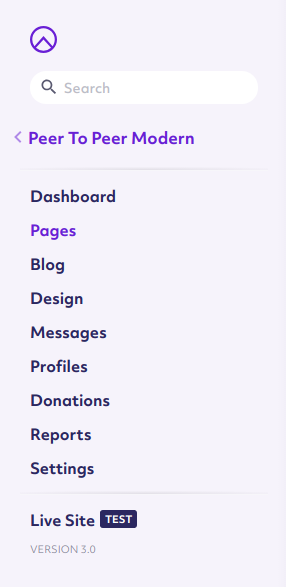

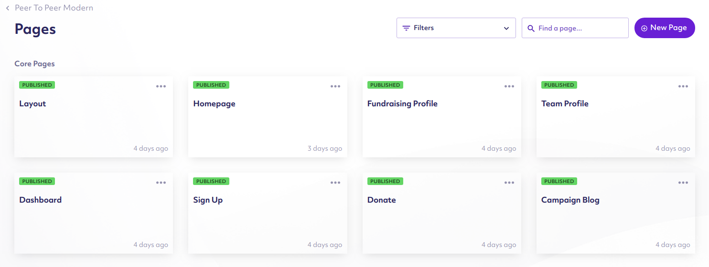

Selecting an available page (such as **Homepage**) will bring up our Raisely Page editor interface.

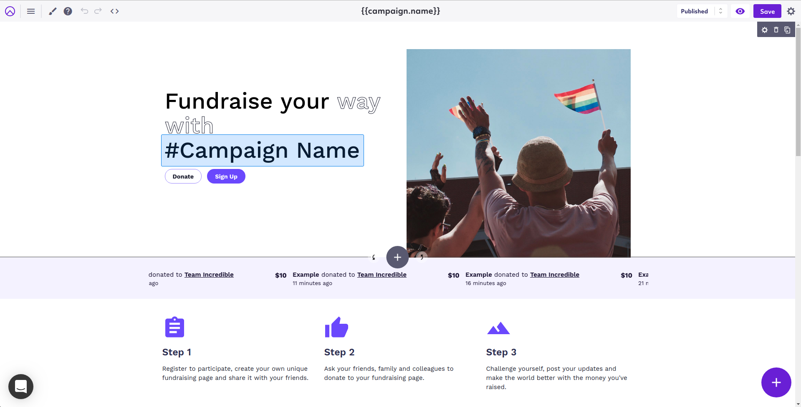

There's a lot going on on this page, but our main attention will be solely on the purple **Add Button** located on the bottom right of the screen. Clicking that button will bring up two smaller items on the left and top portions of the **Add Button**.

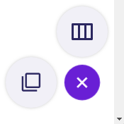

Clicking the button on the left will bring up the **Block Add** tool, enabling you to add various Components to the currently edited page.

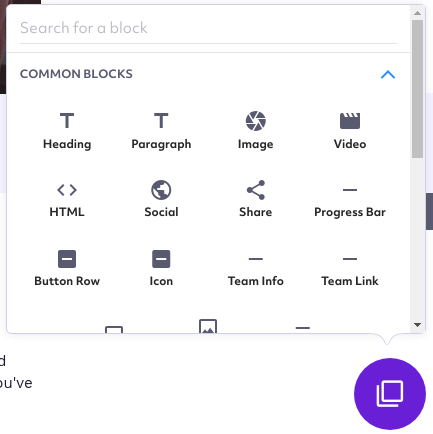

Since we named our Custom component **our-first-component**, we can find our Block simply by typing **"Our"** in the top text element labeled **Search for a block**. Our custom component will then appear as **"Our First Component"** within the results beneath the input.

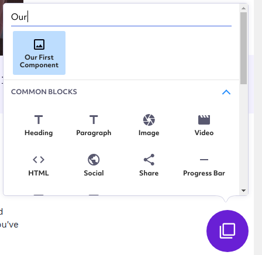

Clicking **Our First Component** will allow us to insert the component within several possible locations on the page. Hovering over areas of the page, and clicking sections labeled **INSERT HERE** will insert the component.

The block will be placed in the location you selected.

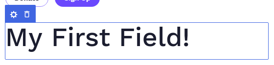

Hovering over the newly placed block will additionally bring up a small blue area on the top left. Clicking on the **Gear** icon will open up the the settings for our newly added custom component, which will appear on the right side of the screen.

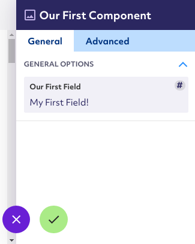

The text field **Our First Field**, allows us to change the values for this specific page component, allowing us to reconfigure the text it displays to the user. Editing this value will automatically update the text within our basic component on the page.

> If you set the field name in the previous step something other than **"Our First Field"**, it'll be shown with the label you specified. 

Pressing the green checkmark button (:heavy_check_mark:) will save our new values and close the settings view. 

## Component versioning

Custom components are locked by version numbers. Each time you update a component, the version of that component will automatically increase by one. As a result, any updates to Custom Components from the Custom component editing interface will need you to manually remove the old blocks from custom components and insert the new ones in place.

> Developer notes: We are considering implementing an opt-in upgrade procedure to automatically update an already added custom component block, though there are design implementations.

