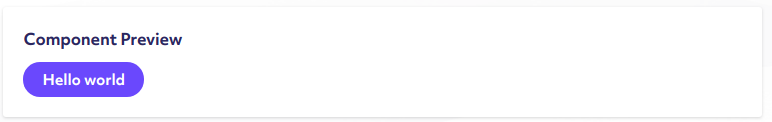

# Building complex Custom Components

> The following guide assumes you have some familiarity with React and JSX concepts. At minimum, it is recommended that you have some experience with JavaScript before continuing with this guide. There are some great free resources available at [freecodecamp.org](https://www.freecodecamp.org/).

## Fundamental concepts

### Building components

Custom Components exist within a scoped function that is expected to return a valid [React component](https://reactjs.org/docs/components-and-props.html), which takes the form of another `function` or a `React.Component` `class`.

```js
// functional component (direct return)
() => () => <div className="my-component" />;

// functional component (scoped return)
() => () => {
    return (
        <div className="my-component" />
    );
}

// class component example
() => class MyComponent extends React.Component {
    render() {
        return (
            <div className="my-component" />
        );
    }
}
```

Both of the functional types above provide a more direct way to express components. You can still access prop values, as well as access values within the surrounding parent scope.

`React.Component` (`class`) components, while not as eloquently expressed as functional components, allow you to take advantage of state management via bound methods like `this.setState`, and class methods that allow you do perform actions depending on certain triggers, commonly known in React as [lifecycle methods](https://reactjs.org/docs/state-and-lifecycle.html). 

As a rule of thumb, functional components are best used when you don't need state changes, while class components should also be used when state changes are needed to enhance the usability of your component, such as when a user's actions directly affect the component (such as a form).

### Using the parent scope

Raisely's Custom Components are built to require a surrounding function to return the React Component you specify. We do this to allow components to live independently, which makes building and implementing them within Raisely much easier.

The secondary benefit of this is that having a surrounding function allows developers to build and extend other components in a much more complex way.

A simple example of this would be using the parent scope to generate a reusable button component.

```js
() => {
    // a reusable button that only takes a text and color prop
    const ReusableButton = ({ text, color }) => (
        <button className="my-reusable-button" style={{ color }}>
            {text}
        </button>
    );

    // this scope returns a functional React Component
    // that relies on the ReusableButton component we build
    // earlier
    return () => (
        <div className="my-component">
            <ReusableButton text="Hello" color="red" />
            <ReusableButton text="World" color="blue" />
        </div>
    );
}
```

The above would yield a preview like the following:


## Overview of available props

Both the parent scope and the Component props come with a set of values and helpers that can be used to enhance features and utilize additional data to your components.

### Custom Component Props

The props that are passed to the live Custom Component contain various helpers and values that are designed to enrich your components and provide a better experience for your users.

```js
// functional Custom Component props source
() => props => {
    // props are passed directly as a function
    return 'Test Component';
}

// class-based Custom Component props source
() => class MyComponent extends React.Component {
    render() {
        // props are bound to the component instance itself
        const { props } = this;
        return 'Test Component';
    }
}
```

* **`props.getValues()`** - A helper function that will resolve the current field values assigned to a Custom Component

* **`props.resolveTarget(targetType, target?)`** - A helper function that attempts to resolve relevant `campaignUuid` and either `profileUuid` or `userUuid` values based on current global state.
    ```js
    // show a specific profile
    const targetProfile = props.resolveTarget('profile', 'some-profile-uuid');
    // show the specific fundraising page being viewed
    const targetCurrentProfileInView = props.resolveTarget('current');
    // show any fundraising profiles owned by the logged in user
    const targetOwnedProfiles = props.resolveTarget('owned');
    ```

* **`props.processFormData(formData)`** - A helper function for converting customField based form state into and `Object` that resemble their Raisely models. This is best used with custom Signup Forms or profile create steps.

* **`props.getFormValues({ fields, from })`** - A helper function to make preloading exisiting forms easier. `fields` represent the `props.global.customFields` value to use, and `from` represents the `global` path to resolve data from. An example of this would be the following:
   ```js
    // generate profile form with defaults resolved from the user's profile
    const initialValues = props.getFormValues({
        fields: props.global.customFields.profile,
        from: 'user.profile',
    });
    ```

* **`props.actions`** - grouping of functions that directly modify the current state of the client
  * `addUser(userModel)` - updates the currently logged in user with the one provided
  * `addUserProfile(userProfile)` - updates the logged in user's profile model with the one provided
  * `addUserParentProfile(parentProfile)` - updates the logged in user's profile parent model with the one provided
  * `addSuccessMessage(message)` - Shows an aside message containing the specified string
  * `addWarningMessage(message)` - Shows an aside warning message containing the specified string
  * `addErrorMessage(message | Error)` - Shows an aside error message containing the specified string, or the `error.message` from the provided `Error` object 
  * `triggerPageStreamRefetch()` - refreshes stream-based components on the page
  * `fetchAndUpdateUser()` - refreshes the currently logged in model with the same data currently stored with Raisely
  * `registerIntegration(integrationId, integrationFcn)` - Adds a new component integration layer for broadcasting messages to third-parties
  
* **`props.node`** - immutableJS node representing the Custom Component's internal data (using `props.getValues` is recommended over accessing props.node directly)

* **`props.global`** - A live storage area containing contextual campaign, page, and user information.
  * `campaign` - The current campaign
  * `user` - The currently logged in user (if present)
  * `user.profile` - The currently logged in user's profile (if present), also contains any relevant parent profiles nested within.
  * `customFields` - various groupings of field definitions commonly used in areas such as built-in Raisely forms, Signup forms, and donation forms
  * `current` - Represents the data being represented by the current page in view. If no dynamic view is present then is only an empty `Object`
  * `current.profile` - The profile model representing the current individual or team profile page being shown
  * `current.post` - The post model representing the currently shown post (used on post page)
  * `languages` - key-value store of lowercase language codes and their english/regional name
  * `countries` - key-value store of uppercase country codes and their english name, official currencies and languages
  * `currencies` - key-value store of uppercase currency codes and their roughly currency equivalence in comparison to USD, their unicode currency symbols, and if they are known zero-cent currencies.
  * `routes` - An array of known static client pages, with each item containing path, title and conditional information.
  * `variableroutes` - An array of known dynamically routed client pages, with each item containing path, title and conditional information.
  
* **`integrations`** - A storage space for currently registered client integrations, such Google Analytics, Google Tag Manager, Facebook Pixel and Twitter Pixel.
  * `broadcast(eventId, eventPayload)` - An exposed event emitter for broadcasting an event to all supported integrations. Many Raisely components, such as the Signup and Donation Form do this for you.

* **`match`** - Information regarding the currently routed page shown on Raisely
  * `params` - `Object` containing key-values of information resolved from the current url (used on profile and post pages)

* **`router`** - Information regarding the current window location
  * `location` - Information about the current browser location

* **`api`** - A reference to the Raisely client api interface. Contains helper functions for performing actions like fetching and creating donations, profiles, and other aspects of the Raisely front-end. (Learn more [here]). 

* **`RaiselyComponents`** - A reference to a collection of built-in Raisely components and helpers. (See the section titled [Using Raisely Components]() for more information)

### Parent scope parameters

The top level parent scope has some additional function parameters that are passed for convenience.

```js
// Custom Component parent props source
(RaiselyComponents, React) => () => {
    return 'Test Component';
}
```

The **first** parameter is an additional reference to the `RaiselyComponents`, which gives you access to several helpers and reusable components designed to make life much easier. This is optional, though can be most beneficial if you are creating complex components.

```js
(RaiselyComponents) => {
    // create a reference to the Raisely Button Atom
    const { Button } = RaiselyComponents.Atoms;

    return () => (
        <Button>
            Hello world
        </Button>
    );
}
```

The previewing the above component will yield a Raisely button with it's default settings:


The **second** parameter is a scoped reference to `window.React`. This is strictly optional to pass, and not passing it will not prevent using `React` since it is already contained within the parent scope.

> All the main exports of React, including `Fragment`, `Component`, and `createContext` can be accessed via the `React` object.

## Using RaiselyComponents

Found in both the parent scope parameters and the props of Custom Components, `RaiselyComponents` provides means of accessing a large set of internal Raisely components that are tailored to various aspects of a campaign, such as:

* A campaign's existing configuration (font sizes, heading colors, button padding, e.c.t)
* Common layouts, such as a listing of profiles, or a list of relevant donations
* Frequently used helpers for things like forms, data pagination, and value formatting

Below are summaries of the various RaiselyComponent groups and their core functionality.

> Note not all RaiselyComponent values are listed, since available aren't entirely viable as reusable components. Those components have been omitted from this article.

### Link

The `Link` component enables the linking of pages within a Raisely campaign without the need to reload the browser tab. This is done via Raisely's client router, which is responsible for determining what pages should be visible based on the current browser location.

Instead of traditional anchor tags, the `Link` component should be used to ensure that page reloads are infrequent, giving users a much better user experience.

```js
(RaiselyComponents) => {
    const { Link } = RaiselyComponents;

    return () => (
        <Link to="/donate">
            Make a donation
        </Link>
    );
}
```

### Atoms

Atoms represent the smallest representation of a reusable feature.

---

#### Button

A styled button that takes an `href` prop or `onClick` prop, a `theme` prop representing the button type.

```js
(RaiselyComponents) => {
    const { Button } = RaiselyComponents.Atoms;

    return () => (
        <React.Fragment>
            <Button
                theme="secondary"
                onClick={() => console.log('clicked')}
            >
                My Normal Button
            </Button>
            <Button
                theme="secondary"
                href="/donate"
            >
                Make a donation (link button)
            </Button>
        </React.Fragment>
    );
}
```

---

#### DonationTile

A display that visually represents a donation. Takes a `donation` prop, and the `campaign` provided by the campaign.

```js
(RaiselyComponents) => {
    const { DonationTile } = RaiselyComponents.Atoms;

    const donationModel = {
        amount: 1000,
        createdAt: '2019-05-01T19:37:51-04:00',
        currency: 'AUD',
        firstName: 'Example',
        lastName: 'Donor',
        profile: null,
        uuid: '65cd4815-8b99-4ab1-932d-f194a0aed524',
    };

    return (props) => (
        <DonationTile
            donation={donationModel}
            campaign={props.global.campaign}
        />
    );
}
```

---

#### Dropdown

A dropdown display atom typically used within the `Header` molecule to display listed menus. Takes a `subMenu` prop representing the menu shown, `title` representing the title of the dropdown, and `link` representing the link of the top dropdown (if no items are provided).

```js
(RaiselyComponents) => {
    const { Dropdown } = RaiselyComponents.Atoms;

    const mySubMenu = [{
        title: 'First Menu Item',
        link: '#',
    }, {
        title: 'Second Menu Item',
        link: '#',
    }];

    return () => (
        <Dropdown
            title="My dropdown menu"
            subMenu={mySubMenu}
        />
    );
}
```

---

#### Icon

A component representing a `material-icon` or internal Raisely icon. Takes a `name` prop representing the material icon name, `size` of either `small | normal | medium | large | x-large`, `color`, and `className`.

```js
(RaiselyComponents) => {
    const { Icon } = RaiselyComponents.Atoms;

    return () => (
        <Icon
            name="raisely"
            size="x-large"
            color="#98e"
        />
    );
}
```

A more complete list of valid icon names can be found [here](https://material.io/tools/icons/)

---

#### Input

A styled input component that can represent various types of input. In a typical implementation, only takes a `label`, `id`, `value`, and `change`. `active` must be passed to indicate that the provided field is editable.

```js
(RaiselyComponents) => class ClassComponent extends React.Component {
    state = {
        myField: '',
    }

    render() {
        const { Input } = RaiselyComponents.Atoms;

        // a generic text field
        return (
            <Input
                active
                type="text"
                id="myField"
                label="My Field"
                value={this.state.myField}
                change={(id, value) => this.setState({ [id]: value })}
            />
        );
    }
};
```

Various types of the component are supported: 
`interval | password | number | array | boolean | select | text | textarea | currency | select-currency | path | checkbox | date | file | hidden | phone | address`

`select` expects an array of options to be passed, where each item can be either a `string` value or an `object` in the form `{ label: 'Option A', value: 'option-a' }`.

---

### Molecules

Molecules represent more complicated combinations of Atoms, usually representative of more complicated data.

#### DonationForm

The `DonationForm` component is a highly configurable component that enables donors, participants, and team leaders to continue various donations to your cause.

The `DonationForm` component is contextually aware, so if it lacks certain configurations it will attempt to detect where to attribute a donation (campaign or profile), depending on what page it's implemented on.

In example, if there is a `DonationForm` present on a **Fundraising Page**, the donation form will attribute the donation to the total of the profile provided by `global`.

The below example demonstrates a minimally configured `DonationForm` that will make it's best effort to resolve the data required to enable donations. Various alternative configurations are also provided for reference and testing.

```js
(RaiselyComponents) => {
    const { DonationForm } = RaiselyComponents.Molecules;

    // minimal configuration
    const bareConfiguration = {};

    // target a specific profile and provide a custom
    // currency to show the amounts in (by default)
    // currency can be any valid Raisely currency
    const targetSpecificProfile = {
        profileUuid: 'some-profile-uuid',
        currency: 'AUD',
    };

    // provide opt-in alternative donation form text
    const customMessages = {
        title: 'Make a donation',
        thankYouTitle: 'Thanks',
        thankYouMessage: 'Thanks for your donation',
    };

    // allows a logged in user to donate using
    // existing subscription cards
    const allowExistingCards = {
        existingCards: true,
    };

    // enable donation perks and reward selection
    // if already configured for the campaign
    const enableDonationPerks = {
        perks: true,
    };

    // enable subscription donations
    const enableSubscriptions = {
        recurring: true,
    };

    // integrations and global are required props
    // and are passed down from the Raisely Component props
    return (props) => (
        <DonationForm
            {...bareConfiguration}
            integrations={props.integrations}
            global={props.global}
        />
    );
}
```

#### DonationStream

DonationStream is a `SelfContained` wrapper for rendering lists of relevant donations relative to the campaign or profile provided.

Like all `SelfContained` components, it takes a `limit` specifying the amount of items to show at once, `sort` to indicate to which attribute to sort by, as well as `order` to specify which direction the sort should go.

For a display target it will display donations relative to either an `user` user, a `profile` model, or the `campaign` model depending on what's directly passed to it.

Direction, which is either `horizontal` or `vertical` will change it's mode from stream-based to paginated list respectively.

```js
(RaiselyComponent) => {
    const { DonationStream } = RaiselyComponents.Molecules;

    return (props) => (
        <React.Fragment>
            <DonationStream
                header="Show campaign donations" 
                pollingHash={props.pollingHash}
                campaign={props.global.campaign}
            />
            <DonationStream
                header="Show currently viewed profile donations" 
                profile={props.global.current.profile}
                campaign={props.global.campaign}
            />
            <DonationStream
                header="Show user donations (dashboard)"
                isUser
                user={props.global.user}
                campaign={props.global.campaign}
            />
        </React.Fragment>
    );
}
```

#### Leaderboard

The `Leaderboard` component allows you to list profiles by their `total` or time of signup (`createdAt`).

Like all `Paginated` components, it takes a `limit` specifying the amount of items to show at once, `sort` to indicate to which attribute to sort by, as well as `order` to specify which direction the sort should go.

If `userUuid` is provided, it will show profiles owned by a Raisely user. If `profileUuid` if provided, it will attempt to show any profiles that are direct members of the provided profile. Otherwise, a `campaignUuid` must be provided to show profiles belonging to the provided campaign.

Passing `search` enables you to perform a basic text search for profiles, which is typically useful when making an enhanced profile search, or only wanting to show profiles matching a specified keyword.

Passing `type` of either `GROUP` or `INDIVIDUAL` will enable whether Group or Individual profiles shown be shown respectively.

```js
(RaiselyComponents) => {
    const { Leaderboard } = RaiselyComponents.Molecules;

    return (props) => (
        <React.Fragment>
            <Leaderboard
                header="Show all campaign profiles"
                campaignUuid={global.campaign.uuid}
                limit={5}
            />
            <Leaderboard
                header="Show campaign profiles with 'bob' in name"
                search="bob"
                campaignUuid={global.campaign.uuid}
            />
            <Leaderboard
                header="Show team profiles by team"
                {...props.resolveTarget('profile', 'some-profile-uuid')}
            />
            <Leaderboard
                header="Show the current fundraiser in view (profile page)"
                {...props.resolveTarget('current')}
            />
            <Leaderboard
                header="Show profiles owned by currently logged in user"
                {...props.resolveTarget('owned')}
            />
            <Leaderboard
                header="Show from same team as currently logged in user"
                limit={10}
                {...props.resolveTarget('userTeam')}
            />
        </React.Fragment>
    );
}
```

#### ProfileGrid

The `ProfileGrid` component currently mirrors the `Leaderboard` component in terms of configuration, but is intended to display as a grid like pagination instead of a simple vertical list.

Like all `Paginated` components, it takes a `limit` specifying the amount of items to show at once, `sort` to indicate to which attribute to sort by, as well as `order` to specify which direction the sort should go.

If `profileUuid` if provided, it will attempt to show any profiles that are direct members of the provided profile. Otherwise, a `campaignUuid` must be provided to show profiles belonging to the provided campaign.

Passing `search` enables you to perform a basic text search for profiles, which is typically useful when making an enhanced profile search, or only wanting to show profiles matching a specified keyword.

Passing `type` of either `GROUP` or `INDIVIDUAL` will enable whether Group Profiles, or Individual profiles shown be shown respectively.


```js
(RaiselyComponents) => {
    const { ProfileGrid } = RaiselyComponents.Molecules;

    return (props) => (
        <React.Fragment>
            <ProfileGrid
                header="Show all campaign profiles"
                campaignUuid={global.campaign.uuid}
                limit={5}
            />
            <ProfileGrid
                header="Show campaign profiles with 'bob' in name"
                search="bob"
                campaignUuid={global.campaign.uuid}
            />
            <ProfileGrid
                header="Show team profiles by team"
                {...props.resolveTarget('profile', 'some-profile-uuid')}
            />
            <ProfileGrid
                header="Show the current fundraiser in view (profile page)"
                limit={10}
                {...props.resolveTarget('current')}
            />
            <ProfileGrid
                header="Show from same team as currently logged in user"
                {...props.resolveTarget('userTeam')}
            />
        </React.Fragment>
    );
}
```

#### Share

> To automatically generate contextually aware social media links, see the `RaiselyShare` component.

The `Share` component enables control over specific social media share appliances such as email, twitter, facebook, and clipboard copying.

It expects a required `url` to determine the main url specifically for `facebook`, `twitter`, and `link` sharing.

The `networks` prop is simply an array containing the enabled networks for the component. To comply with the provided `networks`, the `extra` props is intended to contain other relevant data to increase the viability of sharing.

A code example is included below to demonstrate the various `share` networks available and their additional `extra` values.

```js
(RaiselyComponents) => {
    const { Share } = RaiselyComponents.Molecules;

    // a simple share configuration with their expected extra props
    const networksWithRelevantExtra = {
        facebook: {
            // no extra data
        },
        twitter: {
            text: 'Generic share text',
            hashtags: '#somehashtags'
        },
        whatsapp: {
            text: 'Generic share text',
        },
        email: {
            subject: 'Email subject',
            body: 'Email body',
        },
        link: {
            // no extra data
        },
    };

    // generate static network and extra props based on the provided configuration
    const networks = Object.keys(networksWithRelevantExtra);
    const extra = Object.assign({}, ...networks.map(n => networksWithRelevantExtra[n]));

    return () => (
        <Share
            networks={networks}
            extra={extra}
            url="https://raisely.com"
        />
    );
}
```

#### RaiselyShare

The `RaiselyShare` component is a contextually aware wrapper component for `Share`, which will attempt to resolve relevant share information based on the campaign configuration, and the current page state.

Because of this, the share `url` and `extra` passed into the `Share` component are updated dynamically to reflect the most relevant share information.

The `url` prop determines the bulk of how the RaiselyShare determines what share messages to use, and what url to attempt to resolve based on the current `props.global` value.

```js
(RaiselyComponents) => {
    const { RaiselyShare } = RaiselyComponents.Molecules;

    // url will attempt to resolve from currently loaded page by default
    // if no relevant contextual values can be resolve, RaiselyShare will
    // assume it's values based on campaign.config based social settings

    return (props) => (
        <RaiselyShare
            global={props.global}
            url="current"
            networks="campaign"
        />
    ); 
}
```

#### MultiForm

The `MultiForm` component helper acts as a means of providing step-based pagination for multiple forms. Unlike the other `Molecules` mentioned earlier, this component is responsible for wrapping components while providing a highly minimal form-like structure.

Multiform expects a `name` prop, as a means of identifying it on the page. `promptOnLeave` is an opt-in message to help prevent users from navigating away from the form too early and loosing out on a potential signup. `promptOnLeave` relies on native browser prompts, so be courteous when selecting a message.

`steps` represents an array of React components to use as each independent step within the form. **Each step is index sensitive, so be careful to ensure that the same steps are typically passed on each render.**

Each component in `steps` inherits all props passed to the `MultiForm`, while also inheriting the following props:

* `step` - A 0-based integer index representing which step in `steps` is currently being rendered.

* `next()` - Shortcut method for navigating to the following step (if available)

* `back()` - Shortcut method for navigating to the previous step (if available)

* `updateStep(index)` - Method for forcefully updating the currently shown step within `steps`.

`error` represents a valid error message to show regardless of the current step. We recommend using `error` as the intentional way to inform user's about errors.

We've included a minimal but detailed example of the best-case use for `MultiForm` as a custom component.

```js
(RaiselyComponents) => {
    const { Input, Button } = RaiselyComponents.Atoms;
    const { MultiForm } = RaiselyComponents.Molecules;

    // a small helper function for performing common signup navigation
    const StepNavigation = ({ step, back, next }) => (
        <React.Fragment>
            <Button onClick={(e) => {
                e.preventDefault();
                back();
            }}>
                Back
            </Button>
            <Button onClick={(e) => {
                e.preventDefault();
                next();
            }}>
                Next
            </Button>
        </React.Fragment>
    );

    // define your steps. Each component represents a step
    const Step1 = (props) => (
        <section>
            <h2>Here is the first step</h2>
            <StepNavigation {...props} />
        </section>
    );

    const Step2 = (props) => (
        <section>
            <h2>Here is the second step</h2>
            <Input
                type="text"
                id="myTextField"
                label="My Text Field"
                change={props.updateValues}
                value={props.values.myTextField}
            />
            <StepNavigation {...props} />
        </section>
    );

    // the final step acts as a placeholder. Once this step is reached
    // the multi-form is considered complete. 
    class FinalStep extends React.Component {
        componentDidMount() {
            // By using React component lifecycle methods, we are
            // able to hook into this components "when I am first
            // placed on the DOM to perform our own form side-effects,
            // like submitting user data, redirecting, and other feats.
            console.log('MultiForm completed!');
        }
        
        render() {
            const { props } = this;
            return (
                <section>
                    <h2>Here is the final step</h2>
                    <pre>
                        {JSON.stringify(props.values, null, 4)}
                    </pre>
                    <StepNavigation {...props} />
                </section>
            );
        }
    }
    
    return class MyFirstMultiFormComponent extends React.Component {
        state = {
            // storage for any errors we may generate
            error: null,
            // storage for any values we save within the MultiForm
            values: {},
        }

        // bind update method. Will be called each time the form updates
        updateValues = (id, value, _touched) => {
            // shallow update field by id
            this.setState({
                values: {
                    ...this.state.values,
                    [id]: value,
                }
            });
        }

        // create a method we use to determine what step components
        // are available NOTE: you should not remove steps here, only
        // adding them depending on your form's desired effect
        determineSteps = () => {
            // here you can dynamically and remove steps as needed.
            // it's best to keep this deterministic based on props, since
            // reducing the number of steps midway can cause errors
            return [Step1, Step2, FinalStep];
        }

        render() {
            return (
                <MultiForm
                    name="name-of-my-form"
                    promptOnLeave="(MultiForm) Are you sure you want to leave this page?"
                    steps={this.determineSteps()}
                    updateValues={this.updateValues}
                    values={this.state.values}
                    error={this.props.error}
                />
            );
        }
    }
}
```

### Form

The `Form` component is a means of providing a reusable way to define a collection of fields, let a user input into them, and collect that information as a simple reusable object.

On a fundamental level, `Form` only requires two props to be specified, `fields` and `action`. `fields` represents an array of field definitions that resemble the values expected by `RaiselyComponent.Atoms.Input`. `action` represents a callback function that gets executed when a form is correctly validated. The return value of this function is simply the object that the form resolves.

#### Basic `Form` example

Below is a simple demonstration of a minimally configured form component only taking in a `fields` and `action` prop.

```js
(RaiselyComponents) => {
    const { Form } = RaiselyComponents;

    const myFormFields = [{
        id: 'myDefaultField',
        type: 'text',
        label: 'My text field',
        // the default value of the field (if none is provided)
        default: 'Hello world!',
        // determines if the id is saved directly to the form
        // object, otherwise defaults to the `public.myDefaultField`.
        core: true,
        // optional: indicate that we must have a value set to submit
        required: true,
    }];

    return (props) => (
        <Form
            fields={myFormFields}
            action={async (resultValues) => {
                console.log('submitted values', resultValues);
            }}
        />
    );
}
```

#### CustomFields `Form` example

Raisely uses `customFields`, which are subsets of field data that represent fields and data expected for various core parts of the Raisely core product. These fields are used for various built-in forms, such as the Signup Form, Profile Create Form, and even the Donation Form.

These fields are accessible in `props.global.customFields` as `donation`, `profile` and `user`, and can be passed directly into the `fields` parameter within the `Form` component.

Another benefit of `customFields` is they are representative of the most essential aspects of their models. For example, `customFields.profile` contains the majority of the field information required to assemble a simple Profile model. Knowing this, **we can inversely reuse existing user, profile, and/or donation information to auto-populate a `Form`'s values.**

Included below is an example of a CustomFields-based `Form` utilizing global state and value prefill.

```js
(RaiselyComponents) => {
    const { Form } = RaiselyComponents;

    return (props) => {
        // generate profile form with defaults resolved from the user's profile
        const initialValues = props.getFormValues({
            // the custom fields to use
            fields: props.global.customFields.profile,
            // the global state path to attempt to resolve the model from
            from: 'user.profile',
        });

        // a generic profile form, that attempts to prefill with the
        // currently logged in user's profile.
        return (
            <Form
                values={initialValues}
                fields={props.global.customFields.profile}
                action={async (resultValues) => {
                    console.log('submitted values', resultValues);
                }}
            />
        );
    }
} 
```


### Common

This RaiselyComponents object contains helper code that's typically reusable under certain situations, but is not reliant on the `global` value provided by a Custom Component's props.

> Note that only a limited subset of available helpers are listed, since some of them aren't applicable to enough use cases to be deemed useful for most people. More helpers will be added while Raisely v3 is in beta.

* **`get`** - alias of [lodash.get](https://lodash.com/docs/4.17.11#get)

* **`kebabCase`**: alias of [lodash.kebabCase](https://lodash.com/docs/4.17.11#kebabCase)
  
* **`set`** - alias of [lodash.set](https://lodash.com/docs/4.17.11#set)
  
* **`debounce`** - alias of [lodash.debounce](https://lodash.com/docs/4.17.11#debounce)

* **`isNumber(value)`** - Determines if a value (string or number) can be considered a valid [Number](https://developer.mozilla.org/en-US/docs/Web/JavaScript/Reference/Global_Objects/Number).

* **`currencies`** - key-value store of uppercase currency codes and their roughly currency equivalence in comparison to USD, their unicode currency symbols, and if they are known zero-cent currencies.

* **`displayCurrency(value, currencyCode, options)`** - Will convert a value to the currencies display format specified by the `currencyCode` as a string. `options` represents an opt-in configuration object that allows either `hideCents`, to truncate any cent values if present, and `showFull` which forces the string to return all decimal places instead of cents.

* **`shallowCompareProps(prevProps, currentProps, useKeys?)`** - A Raisely-built helper for determining is simple primitive props have changed. Returns true if a change was detected in a primitive prop, otherwise false. `useKeys` is an optional parameter representing the key names of properties to strictly evaluate.


### `styled` + `css`

The `RaiselyComponents` object also provides access to [Emotion](https://5bb1495273f2cf57a2cf39cc--emotion.netlify.com/docs), which is a powerful toolset for create and maintaining styled components outside of a normal stylesheet. You can learn more about them from our [Adding Styles to Components developer guide](4.adding-styles-to-components.md).
